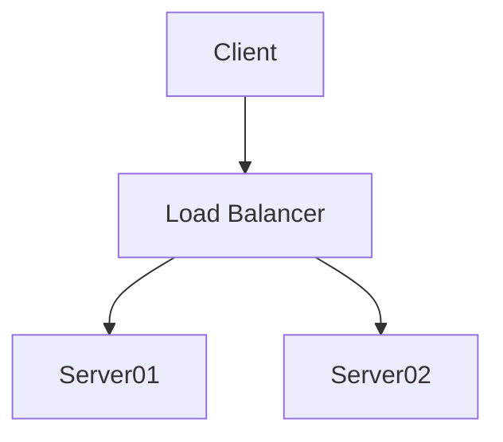

!!! Important
    Documenting the project, changes and designs are just as important as what's being built.

    In 12 months time do you think you'll remember where you were at, what about new contributors?

## Location and Customisation
All project documentation lives in the projects 'docs' directory and written in mark-down format that's easy to update, especially with tools like [VSCode](https://code.visualstudio.com/).

``` bash
docs
├── authors.md
├── changelog.md
├── dev
│   ├── contributing.md
│   ├── documentation.md
│   ├── getting_started.md
│   ├── makefile.md
│   └── python.md
├── helpwanted.md
├── img
│   └── screenshot.png
├── index.md
└── license.md

```

See [mkdocs-material documentation](https://squidfunk.github.io/mkdocs-material/) for more information.

## Build documentation

```bash
make build-docs
```

Will compile all documentation and generate the __site__ directory containing the html documentation this can be viewed locally.

!!! Note
    The __site__ directory is not included in source control as is dynamically generated.

## Viewing Locally

To view or update locally

```bash
make docs-serve
```
This will start up the mkdocs local server and your projects documentation will be available in your browser.

`http://localhost:8000`

## Making changes

Any changes to the document files or mkdocs.yml will be automatically updated when being displayed locally, with a page refresh, on the local server view each time you save, so allows you to see the changes as you make them.

## Adding Diagrams using Mermaid

See official [mermaid documentation](https://mermaid-js.github.io/mermaid/#/) for further instructions on how to make a diagrams.

````markdown

````


## mkdocs.yml Contents

```
--8<-- "././mkdocs.yml"
```